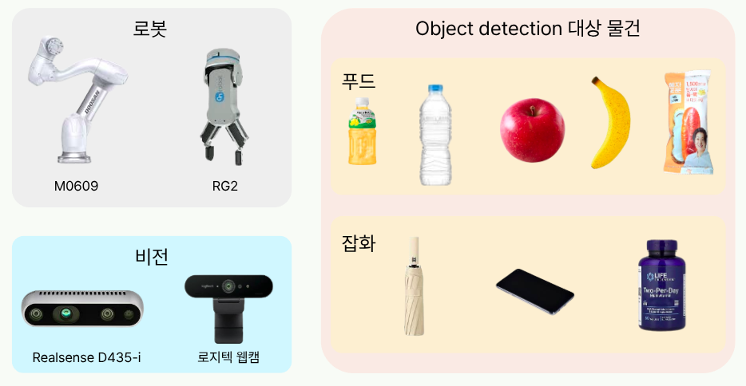
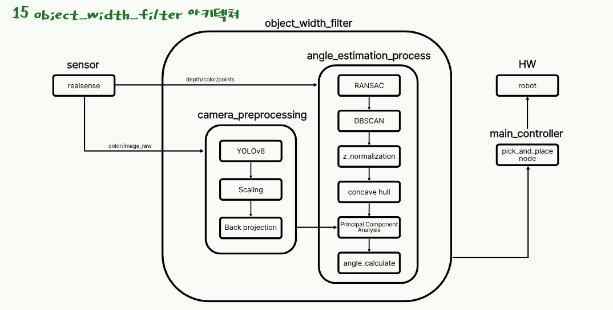
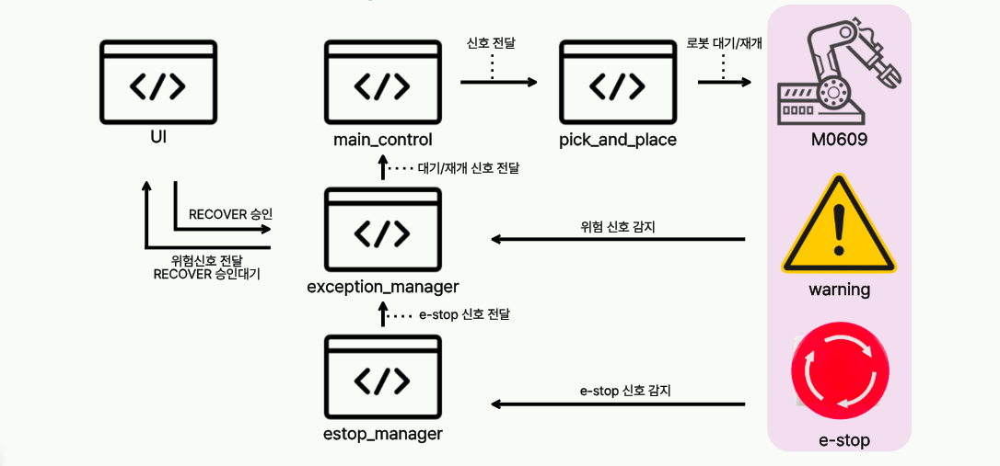
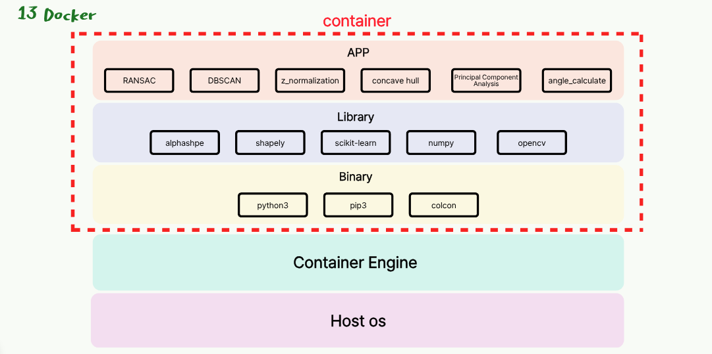
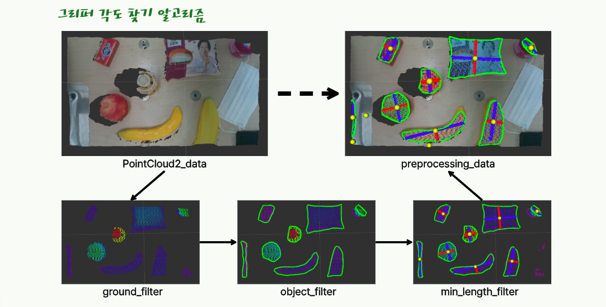
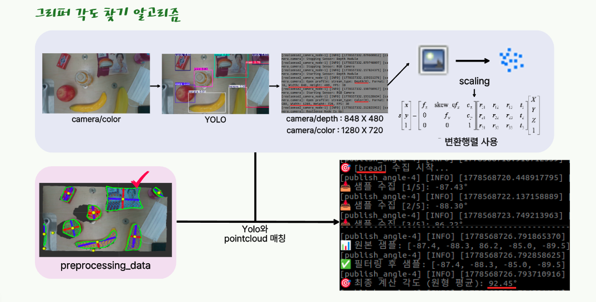
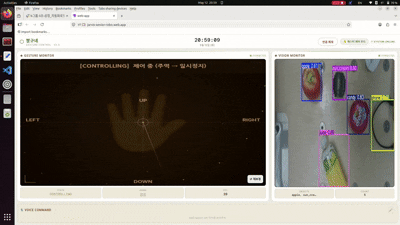
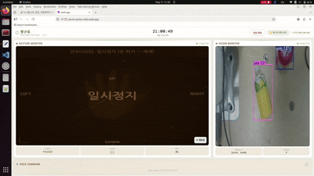

# 🤖 JARVIS — 시니어 보조 협동로봇

ROS2 + WebRTC 기반 음성·제스처·비전 통합 협동로봇 제어 시스템

---

## 프로젝트 배경

대한민국은 빠르게 고령화 사회로 진입하고 있으며, 요양 인력 부족 문제가 심화되고 있습니다.
JARVIS는 이러한 문제를 해결하기 위해 시니어의 일상을 보조하는 협동로봇 시스템으로 개발되었습니다.

단순한 물건 전달을 넘어, **RAG(Retrieval-Augmented Generation)** 기반으로 개별 사용자의 건강 상태와 현재 상황을 파악하여 맞춤형 음식이나 물건을 추천합니다. 예를 들어 당뇨 환자에게는 혈당에 맞는 음식을, 외출 전에는 날씨에 맞는 준비물을 스스로 판단해 제안합니다.

**핵심 기능 요약**
- 음성 명령 / 브라우저 제스처 / 손동작으로 물건 픽앤플레이스
- RAG 기반 사용자 건강 상태 인식 → 상황에 맞는 물건 추천
- 카메라 + VLM으로 주변 환경 스캔 후 자동 픽
- 로봇 이상 상태 감지 및 자동 복구

---

## 링크

| 항목 | 링크 |
|---|---|
| 원본 레포지토리 | [https://github.com/junsu122/Rokey_Cobot2](https://github.com/junsu122/Rokey_Cobot2) |

---

## 활용 장비 및 재료


---

## 구동 방법 (웹 사용 버젼)

### 1. ROS2 빌드

```bash
cd ~/cobot_ws/src/web_cobot_ws
colcon build
source install/setup.bash
```

### 2. ROS2 시스템 실행

```bash
source ~/cobot_ws/src/web_cobot_ws/install/setup.bash
ros2 launch jarvis_bringup jarvis_main.launch.py
```

### 3. 웹 서버 실행 (별도 터미널)

```bash
source ~/cobot_ws/src/web_cobot_ws/install/setup.bash
bash ~/cobot_ws/src/web_cobot_ws/jarvis_webrtc/jarvis_web.sh
```

### 4. 웹앱 빌드 & 배포 (UI 변경 시)

```bash
cd ~/cobot_ws/src/web_cobot_ws/jarvis-ui/web-app
npm run build
firebase deploy --only hosting
```
---

## 구동 방법 (로컬 사용 버젼)

### 1. ROS2 빌드

```bash
cd ~/Rokey_Cobot2
colcon build
source install/setup.bash
```

### 2. 센서 연동

realsense 및 dsr01 연결

### 3. ROS2 시스템 실행 (메인 컨트롤러 런치)

```bash
ros2 launch gesture_robot_pkg gesture_robot.launch.py 
```

### 4. ROS2 시스템 실행 (상태 컨트롤러 런치)

```bash
ros2 launch robot_state_control robot_state_control.launch.py 
```

### 5. ROS2 시스템 실행 (객체 너비 확인 노드 런치)

```bash
ros2 launch object_width_filter object_width_filter.launch.py
```

docker로 대체 가능

```bash
# 1. 도커 컨테이너의 GUI 출력을 허용 (터미널에 입력)
xhost +local:docker

# 2. 통신을 위한 환경 변수 설정 (Bag 파일 실행 PC와 동일하게 맞춤)
export ROS_DOMAIN_ID=95
export RMW_IMPLEMENTATION=rmw_cyclonedds_cpp

# 3. 최신 이미지 다운로드
docker pull junsu122/object_width_filter:v2.1

# 4. 컨테이너 실행 (네트워크, 디스플레이, 카메라 권한 포함)
docker run -it --rm \
  --net=host \
  --env="DISPLAY" \
  --volume="/tmp/.X11-unix:/tmp/.X11-unix:rw" \
  --privileged \
  junsu122/object_width_filter:v2.1

# 5. 런치 파일 실행 (모든 노드 가동)
ros2 launch object_width_filter object_width_filter.launch.py
```

```bash
# 다른 PC의 ~/.bashrc에 추가
alias rf='xhost +local:docker && docker run -it --rm --net=host --env="DISPLAY" --volume="/tmp/.X11-unix:/tmp/.X11-unix:rw" --privileged junsu122/object_width_filter:v2.1'
```

---


## 전체 흐름


### 브라우저 호버 선택 픽

```
브라우저: 물체 위 손가락 hover
    ↓ DataChannel
webrtc_vision_server.py
    → /selected_label 발행
    → 브라우저로 is_picking=True 전송 (모달 표시)
    ↓
vision_node.py (_selected_label_cb)
    → YOLO 탐지 결과에서 원본 좌표 추출
    → /selected_object 발행
    ↓
┌─────────────────────────────────────────┐
│ 동시 처리                                │
│  orchestrator_node.py                   │
│    → PickAndPlace 액션 트리거            │
│                                         │
│  vision_node2publish_angle.py           │
│    → aligned depth + camera_info       │
│    → /_2d_to_3d_point 발행              │
│    → publish_angle.py                  │
│    → /object_angle 발행                 │
└─────────────────────────────────────────┘
    ↓
pick_and_place_node.py
    HOME → APPROACH
    → /selected_object 재발행 (각도 재계산)
    → SPIN_CHUCK (30초 대기, /object_angle 수신)
    → DESCEND → GRASP → LIFT → GIVE
    ↓
orchestrator_node.py → /is_picking=False
    ↓
브라우저: "작업 완료" 모달 표시
```

---

### 음성 명령 픽 (예: "사과 가져다줘")

```
브라우저 마이크 → /browser_stt
    ↓
voice_intent_node.py
    → GPT-4o 3단계 의도 추론
      (intent=bring_object, target=apple)
    → /voice_intent 발행
    ↓
vision_node.py (_voice_intent_cb)
    → YOLO에서 apple 탐지
    → /selected_object 발행
    ↓
orchestrator_node.py + vision_node2publish_angle.py (동시)
    ↓
pick_and_place_node.py
    HOME → APPROACH → SPIN_CHUCK → DESCEND → GRASP → LIFT → GIVE
```

---

### 배고프다 스캔 픽 (예: "나 배고파")

```
voice_intent_node.py
    → 현재 카메라에 음식 있으면 → 바로 픽
    → 음식 없으면 → /scan_request 발행
    ↓
workspace_scan_node.py
    → 지그재그 전체 스캔 (3×3 격자)
    → 각 위치에서 VLM으로 음식 탐지 + 저장
    → 스캔 완료 후 발견 물체 순차 처리:
        ① 물체 위로 센터링 이동
        ② /voice_intent 발행 (from_scan=True)
        ③ 픽 완료 대기
        ④ 다음 물체 반복
    → 모든 픽 완료 후 /scan_result 발행
    ↓
pick_and_place_node.py (from_scan=True)
    HOME 스킵 → APPROACH → SPIN_CHUCK → DESCEND → GRASP → LIFT → GIVE
```

---

### 외출 준비 (예: "나갈게")

```
voice_intent_node.py
    → intent=going_out
    → _plan_going_out_items():
        날씨 API + 카메라 이미지 → o4-mini
        → 우산/썬크림/물/마스크 중 필요한 것 선택
    → 각 물건 순서대로 픽 처리
    ↓
pick_and_place_node.py
    HOME → APPROACH → SPIN_CHUCK → DESCEND → GRASP → LIFT
    → WAY_POINT → GIVE_JOINT → GIVE_LINE (직접교시 위치)
```

---

## 주요 파일 경로

| 파일 | 경로 |
|---|---|
| ROS2 런처 | `src/jarvis_bringup/launch/jarvis_main.launch.py` |
| 비전 노드 | `src/gesture_robot_pkg/gesture_robot_pkg/vision_node.py` |
| 픽앤플레이스 | `src/gesture_robot_pkg/gesture_robot_pkg/pick_and_place_node.py` |
| 오케스트레이터 | `src/gesture_robot_pkg/gesture_robot_pkg/orchestrator_node.py` |
| 각도 계산 | `src/object_width_filter/object_width_filter/vision_node2publish_angle.py` |
| 음성 의도 | `src/jarvis_voice_pkg/jarvis_voice_pkg/voice_intent_node.py` |
| 스캔 노드 | `src/jarvis_voice_pkg/jarvis_voice_pkg/workspace_scan_node.py` |
| 상태 관리 | `src/jarvis_voice_pkg/jarvis_voice_pkg/publisher.py` |
| 상수 | `src/gesture_robot_pkg/gesture_robot_pkg/constants.py` |
| WebRTC 제스처 | `jarvis_webrtc/webrtc_server.py` |
| WebRTC 비전 | `jarvis_webrtc/webrtc_vision_server.py` |
| 대시보드 | `jarvis-ui/web-app/src/Dashboard.jsx` |

---

## 주요 ROS2 토픽

| 토픽 | 설명 |
|---|---|
| `/selected_label` | 브라우저 호버 선택 (라벨) |
| `/selected_object` | YOLO 원본 좌표 기반 픽 트리거 |
| `/object_angle` | 물체 그리퍼 회전 각도 (degree) |
| `/voice_intent` | 음성/스캔 기반 픽 트리거 |
| `/is_picking` | 픽 진행 상태 (브라우저 모달용) |
| `/scan_request` | 스캔 시작/취소 |
| `/scan_result` | 스캔 완료 결과 |
| `/browser_stt` | 브라우저 음성 입력 |
| `/_2d_to_3d_point` | 2D bbox → 3D 카메라 좌표 |

---

## 🙋 내 주요 업무

### 1. [M0609 동작 시퀀스 제작]
> M0609 전체 플로우 동작 설정
> 1. webcam을 이용하여 물체를 선택하거나, STT를 활용하여 물건 추천을 받음
> 2. 선택된 물체의 x,y좌표까지 이동
> 3. 매칭되어 있는 물체의 각도만큼 회전
> 4. 깊이를 추정하여 필요한 깊이까지 내려감
> 5. 그리퍼 닫기
> 6. 그리퍼 올리기
> 7. 잡은 물건 가방에 넣기
> 8. 시행이 끝나고 홈으로 복귀 후, 새로운 명령 대기

---

### 2. [데이터 학습 및 Yolo모델 선정]
- yolov8 ~ yolov12 까지의 모델을 비교
- 프로젝트에 가장 적합하다고 판단이 든 모델을 쓰게끔 결정
  
---

### 3. [물체의 각도 추정 알고리즘 제작]
> realsense의 pointcloud를 이용하여 물체 각도 추정 전체 알고리즘
> 1. RANSAC 알고리즘을 이용하여 바닥을 인식 / 바닥 지우기
> 2. DBSCAN 알고리즘을 이용하여 pointcloud가 모여 있다면 하나의 물체로 인식
> 3. z값들을 한 값으로 normalizaiton 실시 (각도를 구하는 것이므로 계산량 저하 및 직관적인 확인을 위해)
> 4. concavehull 알고리즘을 이용하여 하나의 물체라 인식한 pointcloud 가장 바깥을 선으로 연결
> 5. PCA를 이용하여 가장 긴 부분과 짧은 부분을 인식
> 6. 길이가 가장 짧은 부분의 x축과 각도를 알아내어, 이를 yolo로 인식한 물체와 매칭시킴.


*object_width_filter 전체 아키텍처 (RANSAC → DBSCAN → z_normalization → concave hull → PCA → 각도 계산)*

---

### 4. [외력감지, 비상정지 및 회복 알고리즘 제작]
> **평상시** : `main_node`가 픽앤플레이스 전체 흐름을 관리하며 START/PAUSE/RESUME/STOP 명령을 발행
>
> **이상 감지 시** : `emergency_stop_node`가 0.3초마다 로봇 상태를 감시하다가 외력감지(노란 경고) / 비상정지(빨간 경고)를 감지하면 `main_node`에 이상 신호를 전달 → `main_node`가 동작을 일시정지 또는 중단
>
> **복구 시** : 웹 대시보드 버튼 또는 손바닥 제스처로 복구 신호를 보내면 `exception_manager_node`가 로봇에 복구 명령을 전송하고 `main_node`에 정상 복귀 신호를 전달 → 픽앤플레이스 동작 재개


*외력감지 / 비상정지 감지 및 복구 플로우 (emergency_stop_node → exception_manager → main_node)*

---

### 5. [손바닥 인식을 통한 M0609 동작]
- mediapipe를 이용, 손가락 마디의 크기를 인식하여 손가락 마디의 크기가 작아지면 뒤로 움직이고 마디의 크기가 커지면 앞으로 움직이는 로직 개발

---

### 6. [깃허브 버젼 관리]
- GitHub에서 전체적인 패키지와 모듈을 관리
- 기존 메인 코드를 변경하기 전, 버젼으로 묶어서 관리

---

### 7. [DOCKER 사용 및 배포]
> alphashape, scikit-learn, ultralytics, mediapipe 등 다수의 라이브러리가 opencv 버전을 두고 충돌하는 문제를 해결하기 위해, `object_width_filter` 패키지를 Docker 이미지로 빌드하여 배포
> 1. 충돌의 원인이 되는 `object_width_filter`를 독립된 Docker 환경으로 분리
> 2. `junsu122/object_width_filter:v2.1` 이미지 빌드 및 Docker Hub 배포
> 3. 호스트와 네트워크를 공유(`--net=host`)하여 ROS2 토픽 통신 유지
> 4. `xhost +local:docker` 로 GUI(rviz 등) 출력 허용
> 5. 다른 PC에서도 `docker pull` 한 줄로 즉시 실행 가능하도록 구성


*Docker 컨테이너 구조 — APP(알고리즘) / Library / Binary 레이어로 분리하여 라이브러리 충돌 해결*

---

## 🔧 Trouble Shooting

### 1. [물체를 잡을때의 낮은 정확도]
**증상**
> yolo에서 인식한 물체의 boundingbox 중심점을 기준으로 grip을 하려고 하니, gripper가 바닥까지 내려가거나 물체를 제대로 잡지 않고 눌러서 비상정지가 발생.

**원인**
> 같은 물체라도 세워져 있느냐, 누워 있느냐에 따라 잡아야하는 부분이 달라짐. gripper가 잡을 수 있는 최대 넓이 보다 물건의 폭이 더 넓으면 잡지 못함.

**해결 방법**
> 물건마다 가장 얇은 폭을 인식하도록 하여, 물체를 잡을때 가장 성공률이 높은 각도로 잡도록 움직임을 유도시킴.


*물체의 가장 짧은 폭 방향 각도 추정*


*추정된 각도를 YOLO 인식 물체와 매칭하여 최적 grip 방향 결정*

<table>
  <tr>
    <td align="center"><b>예외처리 - 웹</b></td>
    <td align="center"><b>예외처리 - 카메라</b></td>
  </tr>
  <tr>
    <td></td>
    <td></td>
  </tr>
  <tr>
    <td align="center"><b>비상정지 - 웹</b></td>
    <td align="center"><b>비상정지 - 카메라</b></td>
  </tr>
  <tr>
    <td></td>
    <td></td>
  </tr>
</table>


---

### 2. [파일을 실행할때마다 opencv 버젼 충돌]
**증상**
> 다른 기능 단위 코드들과 합치고 빌드할때마다, opencv 에러로 인해 따로 빌드하던가 여러번 빌드를 해야하는 불편함 발생.

**원인**
> alphashape, scikit-learn, yolo, mediapipe 등 다양한 library를 사용하면서 버전 충돌 발생

**해결 방법**
> 여러 library를 사용하는 object_width_filter를 docker로 배포하여, 따로 빌드하지 않고 실행할 수 있게함. 

---

## 전체 시연영상

[▶ JARVIS 전체 시연영상 보기](https://youtu.be/0AUDXOjfGCY)
